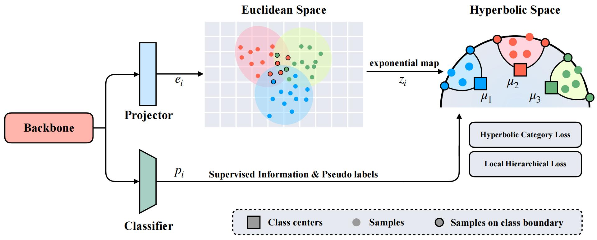

# Hyperbolic Hierarchical Representation Learning for Generalized Category Discovery



This study addresses the problem of Generalized Category Discovery (GCD), an advanced and challenging semi-supervised learning scenario that deals with unlabeled data from both known and novel categories. Although recent research has effectively engaged with this issue, these studies typically map features into Euclidean space, which fails to maintain the latent semantic hierarchy of the training samples effectively. This limitation restricts the exploration of more detailed and rich information and degrades the performance in discovering new categories. The emerging field of hyperbolic representation learning suggests that hyperbolic geometry could be advantageous for extracting semantic information to tackle this problem. Motivated by this, we proposed Hyperbolic Hierarchical Representation Learning for Generalized Category Discovery (HypGCD). Specifically, HypGCD enhances representations in hyperbolic space, building upon the Euclidean space representation from two perspectives: instance-class level and instance-instance level. At the instance-class level, HypGCD endeavors to construct well-defined clusters, with each sample forming a robust hierarchical cluster structure. Concurrently, at the instance-instance level, HypGCD anticipates that a subset of samples will display a tree-like structure in local space, which aligns more closely with real-world scenarios. Finally, HypGCD optimizes the Euclidean and hyperbolic space collectively to obtain refined features. Additionally, we show that HypGCD is exceptionally effective, achieving state-of-the-art results on several datasets.

## Running

### Dependencies

[pytorch-metric-learning](https://github.com/KevinMusgrave/pytorch-metric-learning)

### Config

Set paths to datasets and desired log directories in ```config.py```


### Datasets

We use fine-grained benchmarks in this paper, including:

* [CUB-200-2011](http://www.vision.caltech.edu/visipedia-data/CUB-200-2011/CUB_200_2011.tgz)
* Stanford Cars ([Img](http://imagenet.stanford.edu/internal/car196/car_ims.tgz), [Annotation](http://imagenet.stanford.edu/internal/car196/cars_annos.mat))
- [FGVC-Aircraft](https://www.robots.ox.ac.uk/~vgg/data/fgvc-aircraft/)


We use oarse-grained benchmarks in this paper, including:

* [CIFAR-10/100](https://pytorch.org/vision/stable/datasets.html)
* [ImageNet](https://image-net.org/download.php)

### Scripts

**Train the model**:

```
bash scripts/run_${DATASET_NAME}.sh
```

## Experimental Results
Our results on  whole six datasets:
| Datasets      |  All  |  Old  |  New  |
|---------------|:-----:|:-----:|:-----:|
| CIFAR-10      | 96.6  | 95.5  | 97.2  |
| CIFAR-100     | 79.3  | 80.1  | 77.8  |
| CUB           | 65.8  | 75.1  | 61.1  |
| Stanford Cars | 57.6  | 74.9  | 49.2  |
| FGVC-Aircraft | 54.8  | 63.2  | 50.6  |
| ImageNet-1K   | 55.0  | 75.7  | 44.6  |

## Acknowledgements

The code repo is largely built on this [repo](https://github.com/sgvaze/generalized-category-discovery).

# Citations
If you use our code, please cite our work. :)
